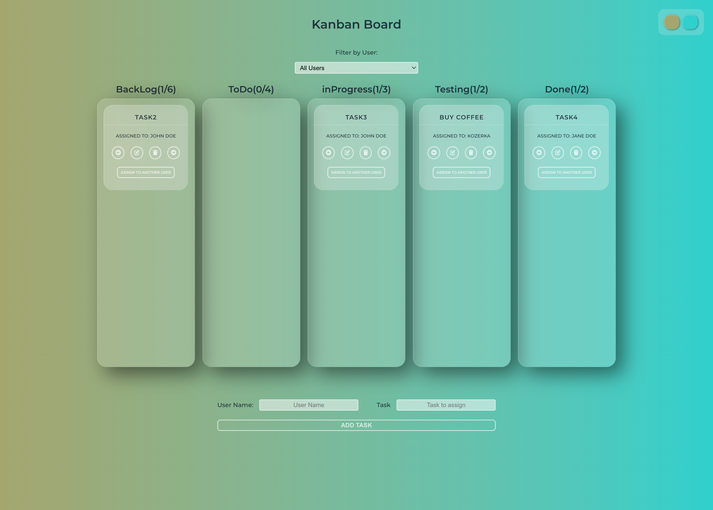
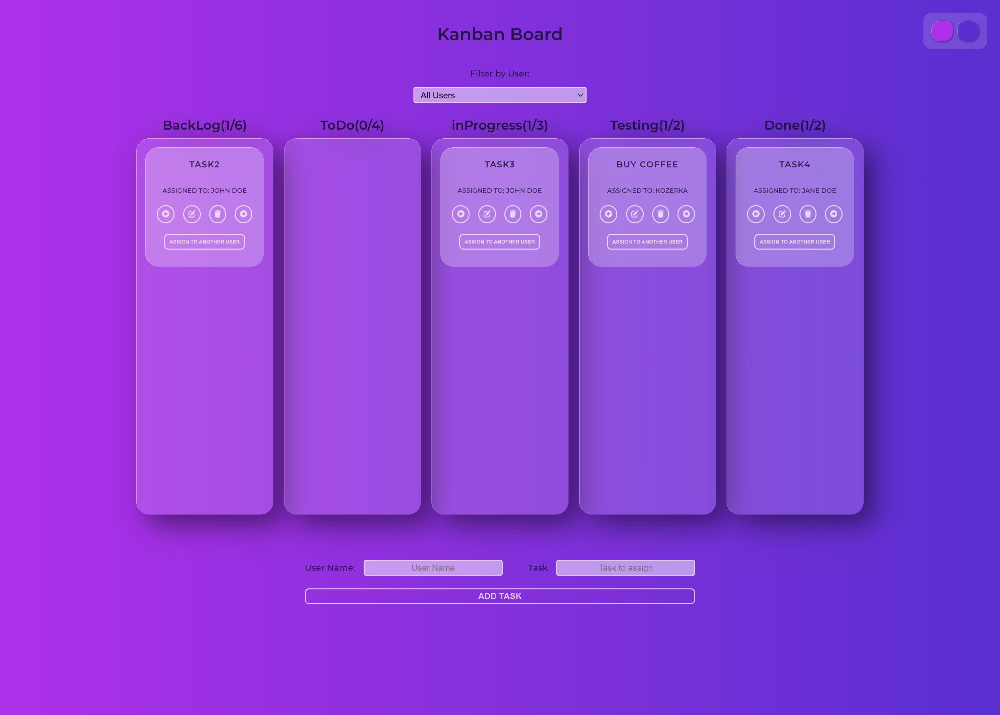
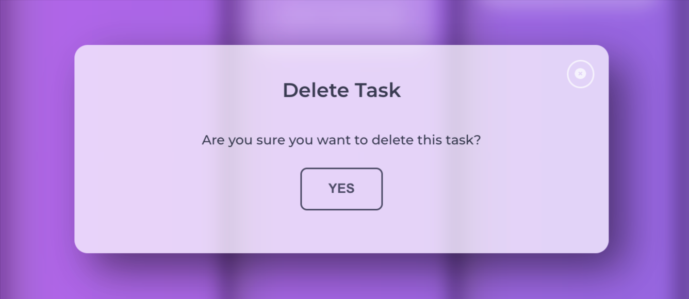
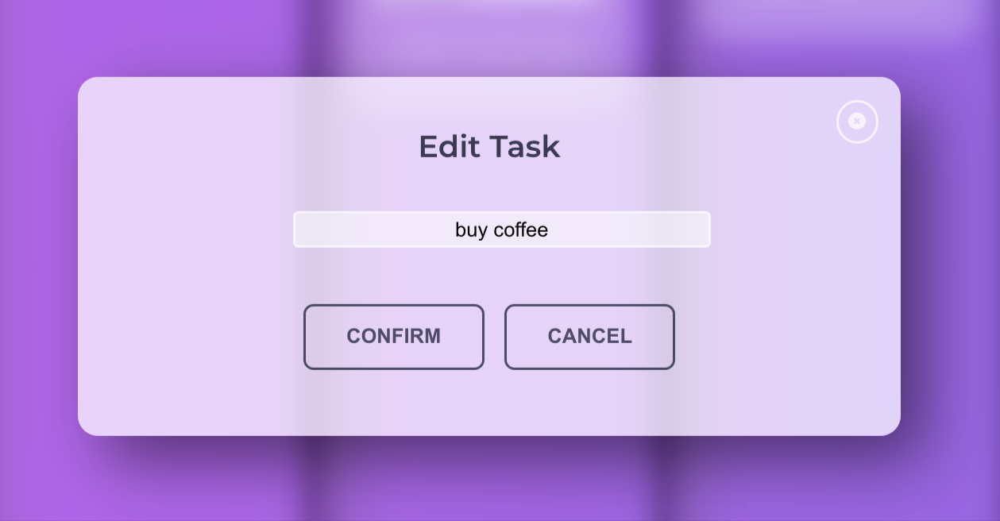
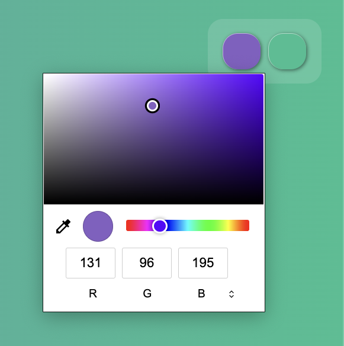
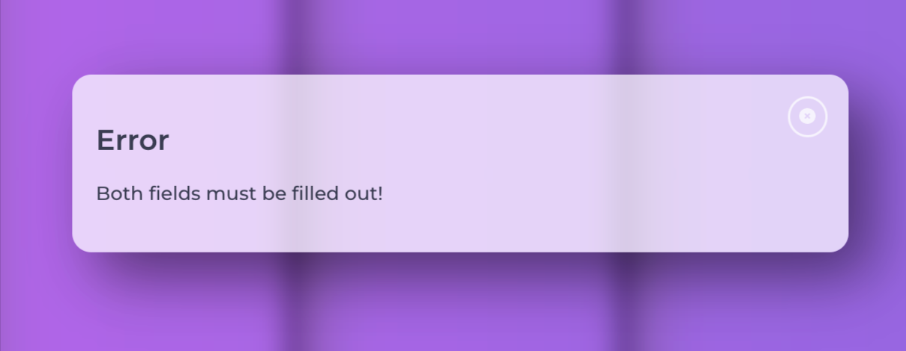

# React Kanban Board

React Kanban Board is a simple tool to help you keep track of tasks. It's based on the popular Kanban method many teams use. With this board, managing your tasks becomes easy and clear.

<p align="center">
  
  
</p>


## Features

1. **Board Columns**: Classic number of columns and tasks limit.
2. **Task Management**: Add tasks with specifics like task name and assignee.
3. **Move tasks**: Move tasks between columns.
4. **Data Persistence**: With the help of `localStorage`, task data will remain intact, even after a browser refresh.
5. **User-Specific Assignments**: Assign tasks to existing users, providing clarity in task management.
6. **Task Manipulation**: Features to edit task details and delete tasks when required.
<p align="center" display="flex">
  
  
</p>

7. **Intuitive User Feedback**: Modals for error notifications.
8. **Personalized UI Experience**: Choose your desired background for the application using the GradientPicker.
<p align="center">
   
</p>
9. **Filtering Capabilities**: Easily filter tasks by the assigned user.


## Technology Stack

   


## Application State Management

This application uses React's Context API to handle the global state. It ensures seamless data flow and state access throughout the components. The app's core state comprises tasks, columns, and users, among other data points.

### Using Local Storage

Data persistence is a crucial feature, especially for task management tools. This application uses the browser's `localStorage` to ensure that your task data doesn't vanish after closing the browser. The app seamlessly integrates `localStorage` to fetch, update, and delete tasks and other related data, giving a smooth user experience.

### Error Handling with Context and Modals

Application displays errors using modals, powered by a dedicated ErrorContext. This context ensures immediate and clear feedback to users, centralizing error management and providing a consistent user experience. Leveraging this approach simplifies real-time error handling across all components.
<p align="center">
   
</p>


## Quick Start

1. Clone the repository:

```bash
git clone [ Repository Link Here]
```

2. Move into the directory:

```bash
cd [ Directory Name Here]
```

3. Install the dependencies:

```bash
npm install
```

4. Run the development server:

```bash
npm start
```

Open [http://localhost:3000](http://localhost:3000) to view it in the browser.

## Learn More About Kanban

If you're new to the Kanban method, I recommend checking out [these four videos by Atlassian](https://www.youtube.com/watch?v=iVaFVa7HYj4&list=PLaD4FvsFdarR3oF1gp5_NmnlL-BQIE9sW&index=1) and this [Polish article](https://productvision.pl/2015/gdzie-scrum-nie-moze-tam-kanban-posle/) to familiarize yourself.


## License

[MIT](https://choosealicense.com/licenses/mit/)

---

Crafted with ❤️ by [kozerka].

---
&nbsp;

## 🙏 Special thanks

Special thanks to my [Mentor - devmentor.pl](https://devmentor.pl/) for providing me with the task.

